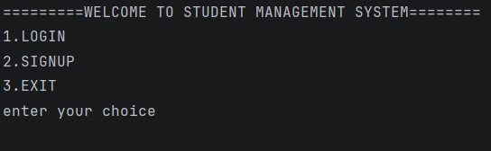
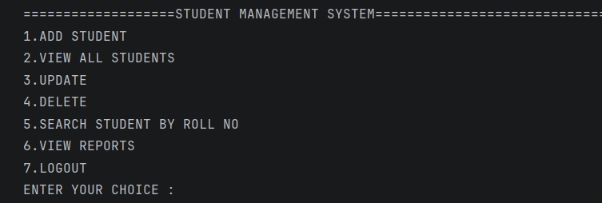
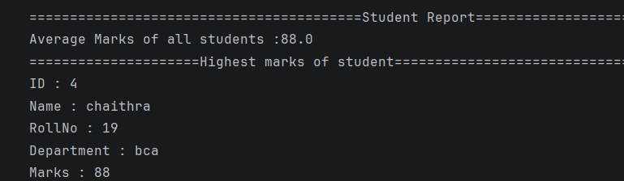

# Student Management System

A console-based Java application to manage student records, built using Core Java, JDBC, and MySQL.

---

## Features

- User Signup and Login with SHA-256 password hashing
- Add, View, Update, and Delete student records (CRUD)
- Search student by Roll Number
- Reports: Average marks and Highest scoring student
- Secure database connectivity using JDBC and PreparedStatement

---

## Tech Stack

| Component  | Technology                  |
|------------|------------------------------|
| Language   | Java (Core Java)             |
| Database   | MySQL                        |
| Connector  | JDBC (MySQL Connector/J)     |
| IDE        | IntelliJ IDEA / Eclipse      |
| Tools      | MySQL Workbench, Git, GitHub |

---

## Project Structure

```
student-management-system/
├── src/
│   ├── Main1.java              # Entry point, menu-driven console UI
│   ├── DBConnection.java      # Handles JDBC connection setup
│   ├── auth/
│   │   ├── Signup.java        # User registration logic
│   │   └── Login.java         # User authentication logic
│   ├── student/
│   │   ├── Student.java       # Student model class
│   │   └── StudentDAO.java    # CRUD operations for student records
│   ├── reports/
│   │   └── ReportGenerator.java  # Average marks & top scorer logic
│   └── util/
│       └── PasswordUtil.java  # SHA-256 password hashing utility
├── screenshots/
│   ├── login.png
│   ├── student_list.png
│   └── reports.png
├── lib/
│   └── mysql-connector-j-x.x.x.jar
└── README.md
```

---

## Database Setup

1. Open MySQL Workbench.
2. Run the following SQL:

```sql
CREATE DATABASE student_management;
USE student_management;

CREATE TABLE users (
    id INT AUTO_INCREMENT PRIMARY KEY,
    username VARCHAR(50) UNIQUE NOT NULL,
    password VARCHAR(255) NOT NULL
);

CREATE TABLE students (
    id INT AUTO_INCREMENT PRIMARY KEY,
    name VARCHAR(100) NOT NULL,
    roll_no VARCHAR(20) UNIQUE NOT NULL,
    department VARCHAR(50),
    marks INT
);
```

---

## How to Run

1. Clone this repository.
2. Open the project in IntelliJ IDEA or Eclipse.
3. Add MySQL Connector/J to your project dependencies.
4. Update `DBConnection.java` with your MySQL username and password.
5. Run the SQL script above to set up the database.
6. Run `Main.java`.

---

## Screenshots

### Login Screen


### Student List


### Reports


---

## Author

- **Name**   : Chaithra K M
- **College** : Varadaraja Degree College,Tumkur
- **Degree**  : BCA Final Year
